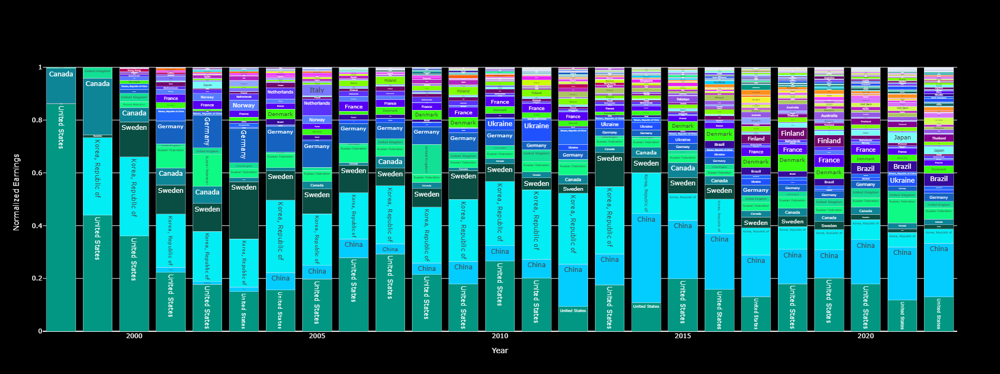
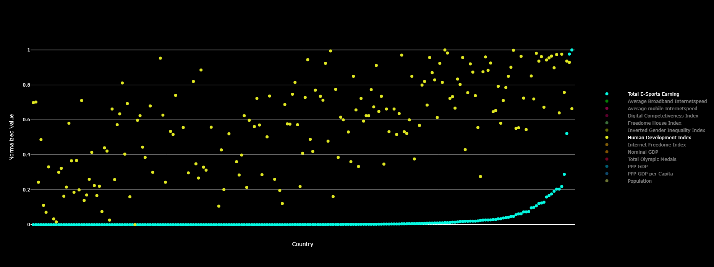
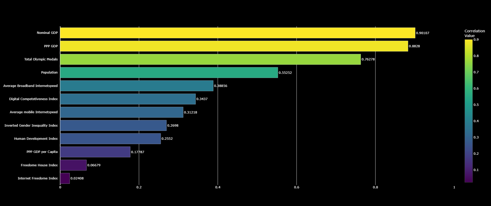

# **Decoding E-Sports Supremacy**

This project investigates the dynamics of competitive dominance in e-sports, focusing on how various factors influence player and team performance across major titles. Through comprehensive data analysis and visualization, it aims to uncover patterns behind sustained success in e-sports ecosystems.

---

## **Overview**

E-sports has rapidly evolved into a global competitive phenomenon with cultural and financial cloud that doesnt fall short of major sports championships. Understanding what drives dominance therefore is required not only by professional players, stakeholders and fans but by obersvers of the political realm it naturally inherits.

This repository offers:

* Data collection and preprocessing pipelines
* Visualizations highlighting key geografical and historic trends in e-sports earnings
* Multi-Faktor analysis that correlates diffrent indicators (GDP, average internet speed, olympic medals) with e-sports earnings

---

## **Data Sources**

The datasets are compiled from www.esportsearnings.com

---

## **Results**

### National Earnings by Genre (Normalized)

---

### Relative Genre Dominance per Country

---

### Correlates of E-Sports Dominance: Scatter Plot

---

### Correlates of E-Sports Dominance: Bar Graph

---

