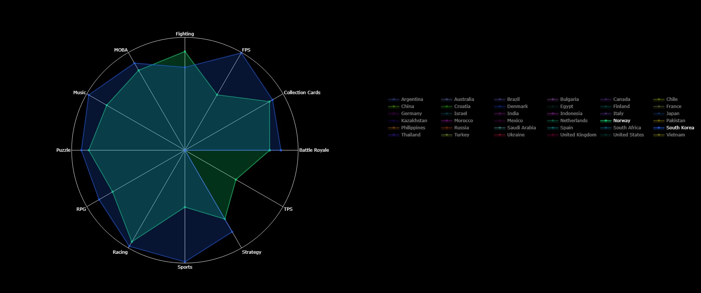

Sure! Here's the full README as plain Markdown text (no code block formatting around it), exactly as you'd put it in your README.md file:

---

# **Decoding E-Sports Supremacy**

This project investigates the dynamics of competitive dominance in e-sports, focusing on how various factors influence player and team performance across major titles. Through comprehensive data analysis and visualization, it aims to uncover patterns behind sustained success in e-sports ecosystems.

---

## **Overview**

E-sports has rapidly evolved into a global competitive phenomenon. Understanding what drives supremacy—be it player skill, team strategies, or meta-game shifts—is key for analysts, coaches, and enthusiasts alike.

This repository offers:

* Data collection and preprocessing pipelines
* Statistical analyses of player/team performance metrics
* Visualizations highlighting key trends and turning points
* Reproducible code for further experimentation

---

## **Data Sources**

The datasets are compiled from public APIs, tournament results, and player statistics across multiple popular e-sports titles (e.g., League of Legends, Dota 2, CS\:GO).

Preprocessing scripts handle data cleaning, normalization, and aggregation to enable meaningful cross-title comparisons.

---

## **Key Features**

* **Performance Metrics:** Computation of advanced stats such as kill/death ratios, win rates, and consistency scores.
* **Temporal Analysis:** Tracking changes in dominance over seasons or patches.
* **Comparative Visualizations:** Interactive charts and heatmaps illustrating supremacy patterns.
* **Open-Source Tools:** Written primarily in Python using libraries like `pandas`, `matplotlib`, and `seaborn`.

---

## **Usage**

To reproduce the analyses and visualizations:

```bash
git clone https://github.com/Pigeon-Effect/Decoding-E-Sports-Supremacy.git  
cd Decoding-E-Sports-Supremacy  
pip install -r requirements.txt  
python analysis.py
```

---

## **Results**

### National Earnings by Genre (Normalized)


---

### Relative Genre Dominance per Country



---

### Correlates of E-Sports Dominance: Scatter Plot


---

### Correlates of E-Sports Dominance: Bar Graph


---

That’s the entire README in plain Markdown text. Just paste it as-is into your README.md file in your repo root. The images will render properly on GitHub assuming your `results` folder is at the root with those PNG files inside.
